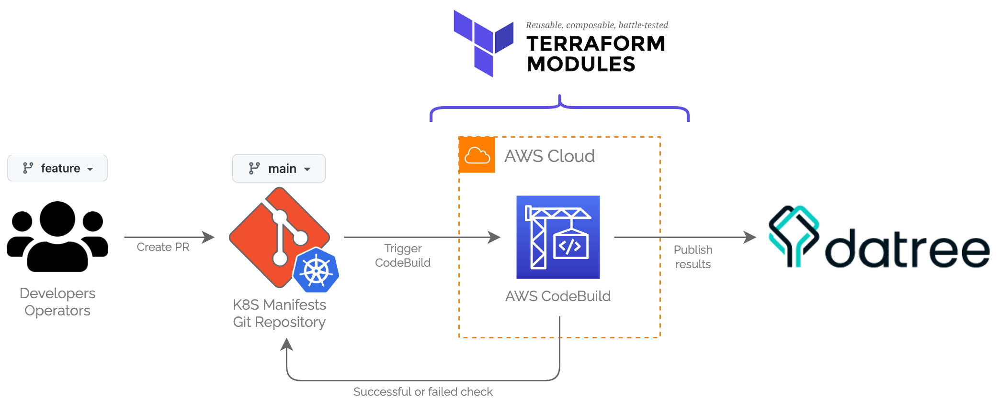

# terraform-aws-k8s-datree-codebuild

> This repository is a terraform module that controls the versioning for the IaC of resources related to K8S Build PR Pipelines.

## Table of Contents

- [terraform-aws-k8s-datree-codebuild](#terraform-aws-k8s-datree-codebuild)
  - [Table of Contents](#table-of-contents)
  - [Diagram](#diagram)
  - [Prerequisites](#prerequisites)
  - [How to run this module?](#how-to-run-this-module)
  - [Requirements](#requirements)
  - [Providers](#providers)
  - [Modules](#modules)
  - [Resources](#resources)
  - [Inputs](#inputs)
  - [Outputs](#outputs)

## Diagram

## Prerequisites

You will need the following tools and config properly installed on your computer.

- [Git](http://git-scm.com/)
- [Terraform](https://www.terraform.io/downloads.html)

## How to run this module?

To use this module, it needs to be invoked. Here are some examples:

- [Complete Example](examples/complete/README.md)

## Requirements

| Name                                                                     | Version |
| ------------------------------------------------------------------------ | ------- |
|  [terraform](#requirement_terraform) | ~> 1.0  |
|  [aws](#requirement_aws)                   | ~> 3.0  |

## Providers

| Name                                             | Version |
| ------------------------------------------------ | ------- |
|  [aws](#provider_aws) | ~> 3.0  |

## Modules

No modules.

## Resources

| Name                                                                                                                                                                                          | Type     |
| --------------------------------------------------------------------------------------------------------------------------------------------------------------------------------------------- | -------- |
| [aws_codebuild_project.build_pr](https://registry.terraform.io/providers/hashicorp/aws/latest/docs/resources/codebuild_project)                                                               | resource |
| [aws_codebuild_webhook.pull_request](https://registry.terraform.io/providers/hashicorp/aws/latest/docs/resources/codebuild_webhook)                                                           | resource |
| [aws_codestarnotifications_notification_rule.codebuild_pr_notifications](https://registry.terraform.io/providers/hashicorp/aws/latest/docs/resources/codestarnotifications_notification_rule) | resource |
| [aws_ssm_parameter.codebuild_pr_payload_url](https://registry.terraform.io/providers/hashicorp/aws/latest/docs/resources/ssm_parameter)                                                       | resource |
| [aws_ssm_parameter.codebuild_pr_secret](https://registry.terraform.io/providers/hashicorp/aws/latest/docs/resources/ssm_parameter)                                                            | resource |

## Inputs

| Name                                                                                                               | Description                                                                                                                                     | Type                                                                                                                  | Default                        | Required |
| ------------------------------------------------------------------------------------------------------------------ | ----------------------------------------------------------------------------------------------------------------------------------------------- | --------------------------------------------------------------------------------------------------------------------- | ------------------------------ | :------: |
|  [codebuild_role](#input_codebuild_role)                                        | Specifies the service role ARN for the codebuild project.                                                                                       | `string`                                                                                                              | n/a                            |   yes    |
|  [kms_secrets](#input_kms_secrets)                                                 | The KMS key alias, id or arn for encrypting SSM Parameters                                                                                      | `string`                                                                                                              | n/a                            |   yes    |
|  [name](#input_name)                                                                      | A prefix string to name all resources                                                                                                           | `string`                                                                                                              | n/a                            |   yes    |
|  [repository_url](#input_repository_url)                                        | Location of the source code from git                                                                                                            | `string`                                                                                                              | n/a                            |   yes    |
|  [arn_chatbot_notification](#input_arn_chatbot_notification)          | The ARN of the chatbot configuration.                                                                                                           | `string`                                                                                                              | `""`                           |    no    |
|  [badge_enabled](#input_badge_enabled)                                           | Generates a publicly-accessible URL for the projects build badge                                                                                | `bool`                                                                                                                | `false`                        |    no    |
|  [branch](#input_branch)                                                                | Specifies the full name of the Git Branch                                                                                                       | `string`                                                                                                              | `"main"`                       |    no    |
|  [build_timeout](#input_build_timeout)                                           | Number of minutes, from 5 to 480 (8 hours), for AWS CodeBuild to wait until timing out any related build that does not get marked as completed. | `number`                                                                                                              | `60`                           |    no    |
|  [compute_type](#input_compute_type)                                              | Information about the compute resources the build project will use.                                                                             | `string`                                                                                                              | `"BUILD_GENERAL1_SMALL"`       |    no    |
|  [datree_app_token_path](#input_datree_app_token_path)                   | The SSM Parameter path where Datree APP Token is stored                                                                                         | `string`                                                                                                              | `""`                           |    no    |
|  [datree_policy](#input_datree_policy)                                           | The Datree policy name to execute policy checks.                                                                                                | `string`                                                                                                              | `"Default"`                    |    no    |
|  [enable_chatbot_notification](#input_enable_chatbot_notification) | Type of repository that contains the source code to be built. Valid values: CODECOMMIT, CODEPIPELINE, GITHUB, GITHUB_ENTERPRISE OR BITBUCKET    | `bool`                                                                                                                | `false`                        |    no    |
|  [environment_type](#input_environment_type)                                  | Type of build environment to use for related builds.                                                                                            | `string`                                                                                                              | `"LINUX_CONTAINER"`            |    no    |
|  [image](#input_image)                                                                   | Docker image to use for this build project.                                                                                                     | `string`                                                                                                              | `"aws/codebuild/standard:5.0"` |    no    |
|  [image_pull_credentials_type](#input_image_pull_credentials_type) | Type of credentials AWS CodeBuild uses to pull images in your build.                                                                            | `string`                                                                                                              | `"CODEBUILD"`                  |    no    |
|  [privileged_mode](#input_privileged_mode)                                     | Whether to enable running the Docker daemon inside a Docker container.                                                                          | `bool`                                                                                                                | `false`                        |    no    |
|  [queued_timeout](#input_queued_timeout)                                        | Number of minutes, from 5 to 480 (8 hours), a build is allowed to be queued before it times out.                                                | `number`                                                                                                              | `480`                          |    no    |
|  [source_type](#input_source_type)                                                 | Type of repository that contains the source code to be built. Valid values: CODECOMMIT, CODEPIPELINE, GITHUB, GITHUB_ENTERPRISE OR BITBUCKET    | `string`                                                                                                              | `"GITHUB"`                     |    no    |
|  [vpc_config](#input_vpc_config)                                                    | A VPC Configuration map to deploy CodeBuild in VPC Mode                                                                                         | <pre>list(object({  security_group_ids = list(string)  subnets = list(string)  vpc_id = string  }))</pre> | `[]`                           |    no    |

## Outputs

| Name                                                                                | Description                   |
| ----------------------------------------------------------------------------------- | ----------------------------- |
|  [codebuild_pr_arn](#output_codebuild_pr_arn) | ARN of the CodeBuild project. |
